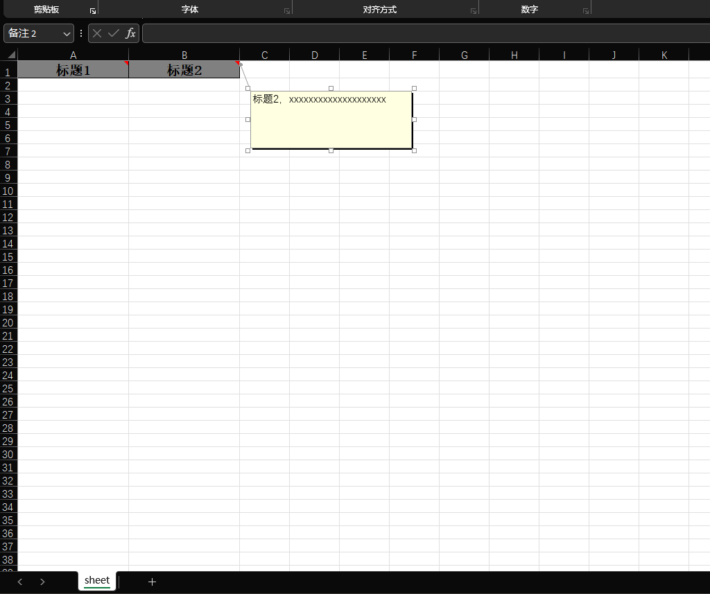

# easyexcel 扩展插件
--
基于 easyExcel **3.3.x** 开发

## 1.注解批注功能
##### 说明
``` java
@Target(FIELD)
@Retention(RetentionPolicy.RUNTIME)
public @interface ExcelComment {

    /**
     * 批注文本内容
     */
    String value() default "";

    /**
     * 批注行高, 一般不用设置
     * 这个参数可以设置不同字段 批注显示框的高度
     */
    int remarkRowHigh() default 2;

    /**
     * 批注列宽, 根据导出情况调整
     * 这个参数可以设置不同字段 批注显示框的宽度
     */
    int remarkColumnWide() default 4;
}
```
##### 代码：
``` java
@ContentStyle(dataFormat = 49)
@HeadStyle(fillForegroundColor= 23)
public class CommentModel implements Model {

    @ExcelProperty(value = "标题1")
    @ExcelComment("标题1，xxxxxxxxxxxxxxxxxxxx")
    @ColumnWidth(value = 20)
    private String title1;

    @ExcelProperty(value = "标题2")
    @ExcelComment("标题2，xxxxxxxxxxxxxxxxxxxx")
    @ColumnWidth(value = 20)
    private String title2;
}
```
   
```java
/**
 * 测试批注
 */
public void testComment(){
    EasyExcel.write()
            .head(CommentModel.class)
            .file(OUT_PATH+"测试EXCEL批准.xlsx")
            .sheet("sheet")
            .registerWriteHandler(new ExcelHeadCommentHandler<>(CommentModel.class))
            .doWrite(CollectionUtils.emptyCollection());
}
```
##### 效果：


## 2.下拉选项
##### 说明
```java
@Documented
@Target({ElementType.FIELD})
@Retention(RetentionPolicy.RUNTIME)
public @interface ExcelSelected {
    /**
     * 类型
     */
    Type type();
    /**
     * 固定下拉内容
     */
    String[] source() default {};
    /**
     * 动态数据类
     * 动态下拉内容
     */
    Class<? extends ExcelDynamicDataSource> sourceHandle() default DefaultDataSource.class;

    /**
     * 动态数据 参数
     */
    String[] sourceParams() default {};

    /**
     *父索引
     */
    int parentColumnIndex() default -1;

    /**
     * 设置下拉框的起始行，默认为第二行
     */
    int firstRow() default 1;

    /**
     * 设置下拉框的结束行，默认为最后一行
     * 65536
     */
    int lastRow() default 65536;

    enum Type{
        //序列
        SEQUENCE,
        //自定义
        CUSTOMER,
        //联级
        CASCADE
    }
}
```

```java
/**
 * 动态生成的下拉框可选数据
 * @author ls
 * @version 1.0
 * @see <a href="https://www.bianchengbaodian.com/article/d539493521d9cf201294e9881b569168.html">参考</a><br/>
 */
public interface ExcelDynamicDataSource {
    /**
     * 获取动态生成的下拉框可选数据
     * @return 动态生成的下拉框可选数据
     */
    String[] getSource(String[] param);
}

```

###### 代码

```java
/**
 * 示例excel下拉选项模型
 * <br/>
 * date: 2024/4/21<br/>
 * version 0.1
 *
 * @author ls<br />
 */
@ContentStyle(dataFormat = 49)
@HeadStyle(fillForegroundColor= 23)
public class SelectdModel implements Model {

    @ExcelProperty(value = "标题1",index = 0)
    @ExcelSelected(type = ExcelSelected.Type.SEQUENCE, source = {"一", "二", "三"})
    @ColumnWidth(value = 20)
    private String title1;

    @ExcelSelected(type = ExcelSelected.Type.CASCADE, sourceHandle = AssociationDataSource.class,parentColumnIndex = 0)
    @ExcelProperty(value = "标题2")
    @ColumnWidth(value = 20)
    private String title2;

    @ExcelSelected(type = ExcelSelected.Type.CUSTOMER, sourceHandle = ParamsDataSource.class,sourceParams = {"1","2","3"})
    @ExcelProperty(value = "标题3")
    @ColumnWidth(value = 20)
    private String title3;
}
```

```java
public class AssociationDataSource implements ExcelDynamicDataSource {
    @Override
    public String[] getSource(String[] param) {
        String key = param[0];
        if("一".equals(key)){
            return new String[]{"1-1","1-2"};
        }
        if("二".equals(key)){
            return new String[]{"2-1","2-2"};
        }
        if("三".equals(key)){
            return new String[]{"3-1","3-2"};
        }
        return null;
    }
}


public class ParamsDataSource implements ExcelDynamicDataSource {
    @Override
    public String[] getSource(String[] param) {
        return param;
    }
}

```

```java
    /**
 * 测试下拉选项
 */
public void testSelect(){
    EasyExcel.write()
            .head(SelectdModel.class)
            .file(OUT_PATH+"测试EXCEL下拉.xlsx")
            .sheet("sheet")
            .registerWriteHandler(new ExcelSelectedHandler<>(SelectdModel.class))
            .doWrite(CollectionUtils.emptyCollection());
}
```

###### 效果：


